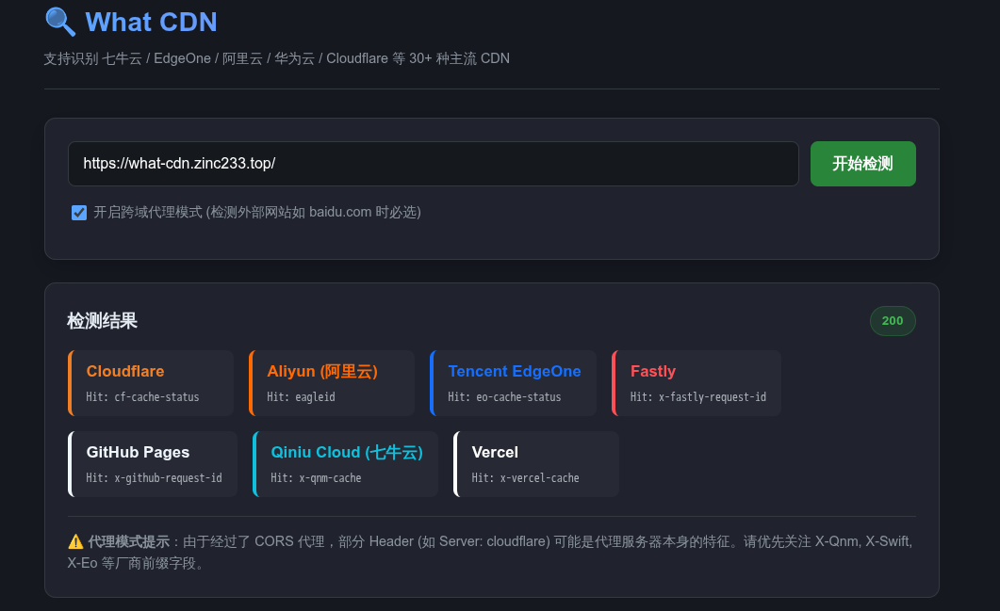

# What CDN

一个简单的通过 header 分析对应网页是套了什么 CDN 的工具。

在线使用地址：
- [主站](https://what-cdn.zinc233.top) 该网站套了6层CDN(Fastly、Vercel、Qiniu、EdgeOne、ESA、Cloudflare)
- [Vercel](https://what-cdn.vercel.app) 这个只经过2层CDN(Fastly、Vercel)
- [Github Page](https://zinc233.github.io/what-cdn) 这个只经过1层CDN(Fastly)